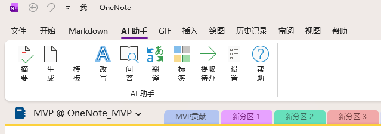

[English](README.md) | **中文**

# OneNote AI Assistant

由 **OneNote MVP** 开发的 Microsoft OneNote AI 智能助手插件。

由于部分地区无法使用 Microsoft 官方的 OneNote Copilot 功能，许多用户在日常笔记工作中无法享受到 AI 带来的效率提升。为了解决这一问题，我们开发了 OneNote AI Assistant —— 一款完全独立的 AI 智能助手插件，让全球所有 OneNote 用户都能在笔记中使用 AI 能力。

本插件不依赖 Microsoft Copilot 服务，通过接入 DeepSeek、OpenAI、Ollama 等 AI 服务（包括本地部署方案），为用户提供灵活、可控、无地域限制的 AI 笔记体验。



## 功能一览

| 功能 | 说明 |
|------|------|
| **摘要** | 对当前页面或整个分区生成 AI 摘要，支持长内容分段处理（map-reduce），输出标准化格式：主题 → 要点 → 结论 |
| **生成** | 根据自然语言指令生成全新内容，自动参考当前页面已有内容作为上下文 |
| **模板** | 从 6 种预设模板快速生成结构化笔记：会议纪要、读书笔记、周报、学习笔记、项目计划、头脑风暴 |
| **改写** | 智能改写选中文本或整页内容，支持自定义改写要求（如"更正式"、"更简洁"、"修正语法"） |
| **知识助手** | 多轮知识问答与资料检索，采用独立的**语义检索 + OneNote Search**，按笔记本、分区组或分区限定范围；可选 Remote HTTPS MCP |
| **翻译** | 翻译选中文本或整页内容，支持 8+ 目标语言（中/英/日/韩/法/德/西/俄），自动识别选中文本 |
| **标签** | AI 自动分析页面内容，生成关键词标签（#格式）、分类和一句话主题摘要 |
| **提取待办** | 智能待办提取（两步法）：第一步读取 OneNote 原生标记（✅已完成/☐未完成），第二步 AI 分析未标记文本发现潜在行动项，严格区分信息列表和真正待办，自动过滤敏感信息 |
| **设置** | 配置 API Key、模型参数、自定义 Prompt 模板，支持多 AI 服务商切换 |
| **帮助** | 内置 Windows 经典帮助窗口，包含 12 个详细主题的使用说明 |

## 支持的 AI 服务商

| 服务商 | API 地址 | 默认模型 | 说明 |
|--------|----------|----------|------|
| **DeepSeek**（默认） | `https://api.deepseek.com` | `deepseek-chat` | 需要 API Key |
| **OpenAI** | `https://api.openai.com/v1` | `gpt-4.1-mini` | 需要 API Key |
| **通义千问** | `https://dashscope.aliyuncs.com/compatible-mode/v1` | `qwen-plus` | 需要 API Key |
| **智谱** | `https://open.bigmodel.cn/api/paas/v4` | `glm-4.5-air` | 需要 API Key |
| **Moonshot** | `https://api.moonshot.cn/v1` | `moonshot-v1-8k` | 需要 API Key |
| **MiniMax** | `https://api.minimax.chat/v1` | `MiniMax-Text-01` | 需要 API Key |
| **Gemini** | `https://generativelanguage.googleapis.com/v1beta/openai` | `gemini-2.5-flash` | OpenAI 兼容端点 |
| **Claude** | `https://api.anthropic.com` | `claude-sonnet-4-20250514` | 原生 Messages API |
| **OpenRouter** | `https://openrouter.ai/api/v1` | `openai/gpt-4.1-mini` | 需要 API Key |
| **Ollama**（本地） | `http://localhost:11434/v1` | `qwen2.5:7b` | 聊天可在本地运行；云端 Embedding/MCP 独立配置 |
| **自定义** | 用户自定义 | 用户自定义 | 任何兼容 OpenAI API 格式的服务 |

### 不改代码接入新模型

模型输入框可以直接填写任意模型 ID，不局限于下拉推荐项。填写服务商提供的模型名和地址即可；如果要固定使用某个 DeepSeek 模型，请关闭自动选模型。

「设置 → API 与模型」新增两项兼容设置，按服务商保存，同时用于连接测试、知识问答和其他功能：

- **输出长度参数**：自动、`max_tokens`、`max_completion_tokens`。自动模式对 OpenAI 和识别出的 OpenAI 推理模型名称使用后者，其他兼容服务保留前者；Claude 始终使用原生 `max_tokens`。
- **温度参数**：自动、发送、不发送。自动模式对识别出的 GPT-5/o 系列推理模型省略温度。新模型或自定义部署别名可按服务商文档手动覆盖，不支持温度时选择不发送。

遇到“`max_tokens` 不支持，请使用 `max_completion_tokens`”时选择后者；若仍提示不支持 temperature，选择「不发送」。不会静默切换模型/端点，也不会自动重试失败请求。支持范围仍是 Chat Completions/Claude Messages，不包含仅提供 Responses API 的模型。

## 系统要求

- Windows 10 或更高版本
- 桌面版 Microsoft OneNote（Microsoft 365 / Office 2019 或更高版本），支持 x86/x64；不支持 OneNote for Windows 10/UWP 或网页版
- [.NET Framework 4.8](https://dotnet.microsoft.com/download/dotnet-framework/net48)
- AI 服务商的 API Key（Ollama 本地部署无需 Key）

### 高 DPI 显示

插件对话框按屏幕原生 DPI 绘制文字和控件，支持 4K 屏幕的 150%、200%、300%
等缩放比例；窗口移到不同缩放比例的显示器时，会同步调整布局和字体。
Per-Monitor V2 需要 Windows 10 1703 或更高版本（含 Windows 11）；
1607 使用 Per-Monitor V1，更早版本保留宿主 DPI 模式并在插件日志中记录警告。
适配仅作用于插件自己的 UI 线程，不改变 OneNote 的 DPI 设置，也不需要修改
`OneNote.exe.config` 或 `dllhost.exe.config`。Ribbon 图标也使用 128 像素原图，
而非放大 32 像素小图。知识助手、索引设置、MCP 连接与工具目录、审批和来源查看窗口
同样适用。安装更新后，请完全退出并重启 OneNote。

## 安装

1. 按下方开发者命令**编译并打包**，或获取可信的安装包。

2. **安装插件**：
   - 关闭 OneNote，运行 `src\OneNoteAI.Installer\Output\OneNoteAISetup-2.1.2.exe`
   - 安装包包含托管依赖及两种架构的 SQLite 原生库，在 x64 Windows 上注册两种 COM 视图

3. **重启 OneNote** — Ribbon 栏出现「AI 助手」标签页（10 个按钮）

4. **配置 API Key**：
   - 点击 Ribbon 的「设置」按钮
   - 输入 API Key，选择服务商
   - 调整模型和参数偏好

## 使用方法

1. 打开任意 OneNote 页面
2. 在 Ribbon 栏「AI 助手」标签页选择功能：

| 按钮 | 操作 |
|------|------|
| **摘要** | 选择范围（当前页/分区）→ 自动生成结构化摘要 |
| **生成** | 输入指令 → AI 生成内容 → 可插入页面 |
| **模板** | 选择模板类型 → 输入关键信息 → AI 按模板结构展开 |
| **改写** | 选中文本（或整页）→ 输入改写要求 → 查看结果 |
| **知识助手** | 选择笔记范围和可选 MCP 连接 → 提问或找资料 → 查看来源 → 继续追问 |
| **翻译** | 选中文本（或整页）→ 输入目标语言 → 查看译文 |
| **标签** | 直接点击 → 自动分析并生成标签/分类/主题 |
| **提取待办** | 选择范围 → 显示原生标记 + AI 发现的行动项 |
| **设置** | 配置 API Key、模型、温度、自定义 Prompt |
| **帮助** | 打开内置帮助窗口，查看详细使用说明 |

3. 其他功能使用结果对话框：
   - 点击「插入页面」将结果写入当前 OneNote 页面
   - 点击「重新生成」重试
   - 点击「复制」复制到剪贴板

## 知识检索

从 Ribbon 打开「知识助手」。「当前页面」无需配置 Embedding 或建立索引；「找资料」不调用聊天模型。跨页检索的配置方式：

1. 打开「索引与 MCP 设置」，配置独立的 HTTPS Embedding 地址和 Key。预设为 `text-embedding-3-small`（默认，1536 维）和 `text-embedding-3-large`（3072 维）。维度填 `0` 使用模型默认值；自定义模型需填写真实维度。
2. 选择允许建立索引的笔记本、分区组或分区，保存后点击「更新索引」。这一步会把授权笔记的文本发送给 Embedding 服务。授权父级包含未来新增的子级；范围以 ID 而非同名目录判断。
3. 切换「选定笔记范围」，在授权范围内选择本次查询范围，然后提问或找资料。语义检索与 OneNote Search 分别召回后融合，不用一条检索路径限制另一条。

**不需要额外部署向量数据库。** SQLite 保存文本、来源、待处理队列与向量；HNSW 按分区和哈希拆分索引，并限制内存缓存。增量更新复用未变化的向量，已持久化的批次可断点续建。可选自动更新每五分钟执行一次，**仅在知识助手窗口打开期间运行**。更换 Embedding 地址、模型或维度需要重新建立相应索引，可能产生新的费用。

OneNote 目录时间与正文时间可能不同，读取时分别比较，并核对正文是否稳定。更新索引会在本地检查授权范围内可访问的页面，包括目录时间未变化的页面；只有内容变化才需要新的 Embedding。范围较大时，本地检查也需要时间。

回答中 `[S1]` 表示笔记来源，`[M1]` 表示 MCP 结果。双击来源可定位笔记或查看工具回执。每次追问重新检索；切换范围或服务身份会清空对话上下文。「保存到当前页」会显式写入回答和来源，来源修改或不可访问后需先重新检索。

界面会显示覆盖率、失败页面和单路降级。尚未索引时可以只走 OneNote Search。检索出的少量片段**不代表完整审阅了整个笔记本**，「没有找到可验证片段」也不代表整本笔记没有答案。很长的当前页同样只选取相关片段；整页或整分区总结请使用原有「摘要」功能。

## Remote HTTPS MCP

在「索引与 MCP 设置 → Remote HTTPS MCP」添加 Streamable HTTP 服务地址，通过官方 MCP C# SDK 支持 JSON/SSE 响应。不支持明文 HTTP、stdio 或旧式独立 HTTP+SSE 传输。认证可选择无认证、Bearer、API-key 请求头或 OAuth。

选择 **Bearer** 时，在 **Bearer token** 中填写该 MCP 服务签发的访问令牌原文，**不要加 `Bearer ` 前缀**。客户端自动发送 `Authorization: Bearer <token>`。它不是聊天模型或 Embedding 的 Key；此模式不使用 API-key header，OAuth 则通过浏览器登录获取令牌。

OAuth 使用系统浏览器、PKCE 和临时 `http://127.0.0.1:<端口>/callback/` 回调；远程服务和授权端点仍须为 HTTPS。部分服务需要预先注册的客户端 ID/密钥或真实的客户端元数据文档 URL；否则服务端需支持动态注册。「本地退出登录」清除本地授权缓存，不等于撤销服务商处的授权。

目录提供 tools、resources 和 prompts，可查看完整 schema、手动调用工具、读取远程资源或获取提示词。**工具默认 Auto approve，包括创建、更新和删除操作。** 可按工具改为 Require approval 或禁用；保存设置后应用于对话。新发现的工具同样默认自动批准，请只启用可信服务。

知识窗口默认不启用 MCP，需要显式勾选连接。自动调用要求聊天模型支持原生工具调用；不支持时在设置中关闭该能力，改用手动工具界面。工具 schema、历史与结果共同占用上下文预算，自定义模型应填写真实上下文上限。

活动记录区分拒绝、工具报错、正常返回和**结果未知**。停止不等于回滚；请求发出后丢失响应会停止工具循环，不自动重放，应先检查远程系统再重试。外部结果只保留在本次会话中，除非显式保存到 OneNote。图片、音频及二进制内容会提示已省略，不会冒充文本处理。

## 隐私与本地数据

- 聊天服务接收问题、选取的证据及已选工具的 schema/结果；Embedding 服务在索引时接收授权笔记文本，在语义检索时接收查询。聊天使用本地 Ollama **不等于**云端 Embedding 或 MCP 也在本地。
- `%LOCALAPPDATA%\OneNoteAI\Knowledge` 保存**明文笔记与向量缓存**，目录 ACL 限定当前用户访问，但并非数据库加密。Key 和 OAuth token 使用 Windows DPAPI；`%APPDATA%\OneNoteAI\settings.json` 保存配置和加密凭据。
- 「清除本地索引」删除笔记/向量/索引缓存，不改动 OneNote，也不删除 OAuth 凭据。临时锁定或缺失的笔记不会参与检索，但不会被视为永久删除。需要移除全部缓存（包括不可用来源）时使用清除功能。卸载保留用户数据。
- 界面默认跟随系统语言；持久化的 `language` 支持 `auto`、`zh-CN`、`en`，设置窗口会保留已有选择。

## 项目结构

```
src\OneNoteAI.AddIn
├── AddIn/              # COM 插件入口 & Ribbon 回调
├── AI/                 # AI 客户端（OpenAI 兼容）、流式输出、Token 估算
│   ├── DeepseekClient     # OpenAI/Claude 原生流式消息与工具调用
│   ├── EmbeddingClient    # 独立 Embedding API、向量校验与归一化
│   ├── ContextBudget      # 包含工具 schema/结果的整请求预算
│   ├── PromptTemplates    # 标准化输出模板（摘要/问答/待办等）
│   ├── ContentChunker     # 长文本分段处理
│   └── TokenEstimator     # Token 计数估算
├── Features/           # 功能命令
│   ├── SummarizeCommand   # 摘要（单页/分区 map-reduce）
│   ├── GenerateCommand    # 内容生成
│   ├── TemplateCommand    # 模板生成（6种预设）
│   ├── RewriteCommand     # 改写
│   ├── QACommand          # 知识助手窗口入口
│   ├── TranslateCommand   # 翻译
│   ├── TagCommand         # 自动标签/分类
│   └── ExtractTodosCommand # 待办提取（原生标记 + AI）
├── Knowledge/          # 授权范围、分块、SQLite、增量索引、HNSW、混合召回
├── Mcp/                # HTTPS 传输、OAuth、目录、schema/批准/执行
├── Conversation/       # 证据注册、重新检索、原生模型/工具循环
├── OneNote/            # OneNote COM 互操作
│   ├── OneNoteProvider    # 页面/分区读取
│   ├── PageParser         # XML 解析（含 Tag 标记识别）
│   └── PageWriter         # 页面写入（Markdown→HTML 转换）
├── UI/                 # 用户界面（OneNote 紫色主题）
│   ├── Theme              # 共享主题类（调色板/字体/按钮工厂）
│   ├── ResultDialog       # 结果展示（流式渲染 + Markdown 格式化）
│   ├── PromptDialog       # 输入对话框
│   ├── ScopeDialog        # 范围选择
│   ├── SettingsDialog     # 设置面板
│   ├── HelpDialog         # 帮助窗口（经典目录树+内容面板）
│   └── ProgressOverlay    # 进度叠加层
├── Settings/           # 加密设置管理（DPAPI）
├── Logging/            # 文件日志
└── Ribbon/             # 自定义 Ribbon XML & 图标
```

## 技术栈

- **语言**: C# 12（固定编译器版本）
- **框架**: .NET Framework 4.8
- **运行时**: COM Add-in (IDTExtensibility2 + IRibbonExtensibility)
- **OneNote 互操作**: Microsoft.Office.Interop.OneNote (v15.0)
- **AI 接口**: OpenAI-compatible Chat Completions、Claude Messages、OpenAI-compatible Embeddings
- **HTTP**: System.Net.Http（SSE 流式传输）
- **JSON**: Newtonsoft.Json 13.0.3
- **索引**: System.Data.SQLite.Core 1.0.119、HNSW 25.3.56901
- **MCP**: ModelContextProtocol.Core 2.2.0、JsonSchema.Net 7.3.4
- **凭据**: DPAPI 加密；笔记缓存未加密
- **安装**: Inno Setup 6.5+
- **编译**: Visual Studio 2022 / 当前 MSBuild 17（建议 17.14）、NuGet PackageReference 与依赖锁文件

## 编译与测试

在 Windows 上安装包含 .NET 桌面开发的 Visual Studio/Build Tools、桌面版 OneNote 及 Office/OneNote 互操作程序集。引用程序集与 C# 编译器通过 NuGet 恢复。在仓库根目录的 Developer PowerShell 中执行：

```powershell
msbuild .\OneNoteAI.sln -restore -p:RestoreLockedMode=true -p:Configuration=Release
.\tests\OneNoteAI.Tests\bin\Release\OneNoteAI.Tests.exe
```

仅运行 DPI 和界面回归场景（需要 Windows 10 1703 或更高版本）：

```powershell
.\tests\OneNoteAI.Tests\bin\Release\OneNoteAI.Tests.exe High-DPI WinForms
```

DPI 场景覆盖中英文窗口的 100%-300% 缩放、原生字体大小、表格表头和用户调整后的
分栏宽度；还会在当前可用显示器之间移动隐藏测试窗口，检查原生 DPI 通知。

测试使用合成笔记、HTTP 响应和隔离配置/缓存目录，不接触真实笔记、付费接口或远程写操作。覆盖配置草稿、解析、流式读取、范围、断点续建、原生工具循环、MCP 策略/OAuth 和 WinForms。ANN 用例包括各 5,000 个 1536/3072 维向量。可按场景名称过滤，例如 `OneNoteAI.Tests.exe MCP OAuth`。

单独验证 x86：

```powershell
msbuild .\OneNoteAI.sln -p:Configuration=Release -p:PlatformTarget=x86 -p:OutputPath=bin\Release-x86\
.\tests\OneNoteAI.Tests\bin\Release-x86\OneNoteAI.Tests.exe
```

打包继续使用 AnyCPU 的 Release 输出。安装 Inno Setup，确认存在 `Languages\ChineseSimplified.isl`（[官方翻译](https://jrsoftware.org/files/istrans/)），然后编译：

```powershell
& 'C:\Program Files (x86)\Inno Setup 6\ISCC.exe' .\src\OneNoteAI.Installer\setup.iss
```

真实 OneNote COM 宿主、不同服务商的浏览器 OAuth 和真实 MCP 服务仍需安装级联调。合成 ANN 用例不能证明大型资料库的延迟、进程总内存上限或人工标注语料上的检索质量。

## 开发者

- **开发者**: OneNote_MVP
- **GitHub**: [github.com/oldding/OneNote-AI-Assistant](https://github.com/oldding/OneNote-AI-Assistant)

## 许可证

Private — All rights reserved.

依赖的许可证与声明见 [THIRD-PARTY-NOTICES.txt](THIRD-PARTY-NOTICES.txt)，同时随安装包分发。
